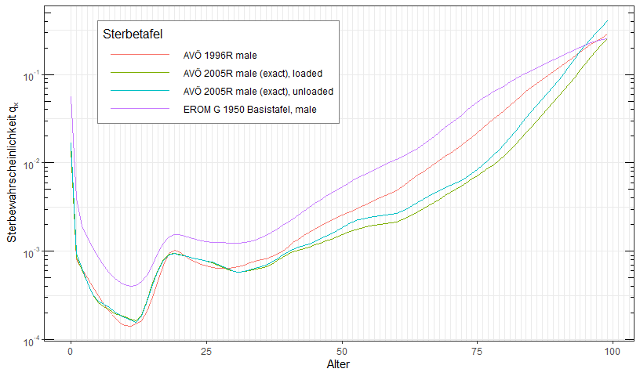
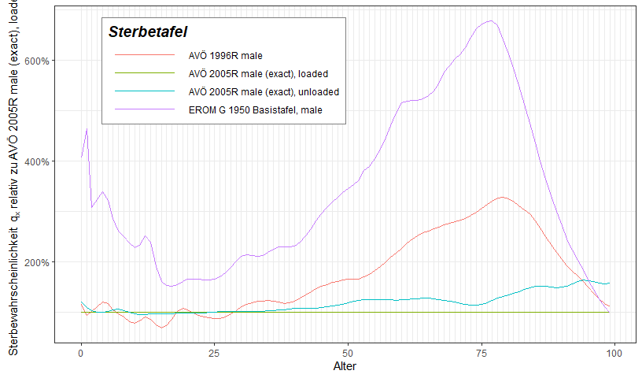
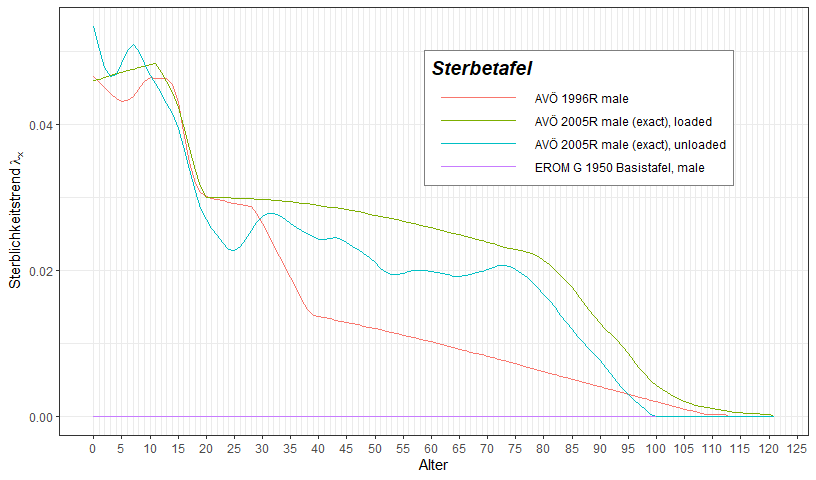

<!-- README.md is generated from README.Rmd. Please edit that file -->

# MortalityTables

<!-- badges: start -->
<!-- badges: end -->

The goal of MortalityTables is to provide generic base classes and
functions to handle all kinds of actuarial actuarial mortality tables
(period and cohort life tables). Cohort and static life tables are
implemented, observed data can be used, and existing life tables can be
blended or extrapolated to derive new tables.

Furthermore, plotting functions are provided for reports and
publications.

## Installation

You can install the development version of MortalityTables from
[GitHub](https://github.com/) with:

``` r
# install.packages("devtools")
devtools::install_github("kainhofer/MortalityTables")
```

## About the package

The MortalityTables package provides the `mortalityTable` base class and
some derived classes to handle different types of mortality tables (also
called life tables), mainly used for life insurance. Additionally it
provides a plot function to compare multiple life tables either directly
using the absolute mortalities in log-linear plots or using relative
mortalities as percentages of a given reference table.

### Types of Life Tables

Provided types of mortality tables are:

-   Base class  
    Class `mortalityTable`

-   Period life table  
    Class `mortalityTable.period(ages, deathProbs, ..., baseYear=2000)`

    Death probabilities observed / predicted for one observation year;
    No dependency on the bith year is assumed.

-   Cohort life table using age-specific trends  
    Class `mortalityTable.trendProjection`

    Death probabilities of a given base year are projected into the
    future using age-specific trends $\lambda_x$. The death probability
    of an $x$-year old in year `baseYear + n` is calculated as:
    $$q_x^{(baseYear+n)} = q_x^{(baseYear)} \cdot e^{-n\cdot\lambda_x}$$

    Consequently, the death probabilities for a person born in year
    `YOB` can be calculated as
    $$q_x^{YOB} = q_x^{(base)} \cdot e^{-(YOB+x-baseYear)\cdot \lambda_x}$$

    -   Cohort life table approximation using age shift

    Class `mortalityTable.ageShift`

    Death probabilities for cohort $YOB$ are obtained by using death
    probabilities for cohort $X$ and modifying the technical age with a
    birth-year dependent shift:
    $$q_x^{YOB} = q_{x+shift(YOB)}^{(base)}$$
    <!-- * Observed life table -->
    <!--     : Class `mortalityTable.observed` -->
    <!--     : Death probabilities observed during several years. The probabilities are -->
    <!--       stored as a matrix with observation year and age as dimensions. -->

    -   Mixed life table

    Class `mortalityTable.mixed`

    Arithmetic mean of two life tables with given weights. This approach
    is often used to generate unisex life tables by mixing male and
    female mortalities with given weights (e.g. 70:30 or 40:60)

-   Cohort life table using age-specific improvement factors  
    Class `mortalityTable.improvementFactors`

    Project base life table using age-specific improvement factors.

-   Pension table  
    Class `pensionTable`

    Four states: active, early retirement / invalidity, old-age pension,
    death (with optional widow)

    All slots describe the corresponding transition probabilities by a

    `mortalityTable`-derived object.

## Loading the MortalityTables package

``` r
library("MortalityTables")
```

## Provided Data Sets

The package provides several real-life life tables published by census
bureaus and actuarial associations around the world. You can use the
function `mortalityTables.list` to list all available datasets (if no
argument is given) or all datasets that match the given pattern
(wildcard character is \*). You can then use `mortalityTables.load` to
load either one single data set or all datasets that match the pattern.

``` r
# list all datasets for Austria
mortalityTables.list("Austria_*")
#>  [1] "Austria_Annuities"                  "Austria_Annuities_AVOe1996R"       
#>  [3] "Austria_Annuities_AVOe2005R"        "Austria_Annuities_EROMF"           
#>  [5] "Austria_Annuities_RR67"             "Austria_Census"                    
#>  [7] "Austria_Endowments_ADSt2426_2Lives" "Austria_PopulationForecast"        
#>  [9] "Austria_PopulationMCMC"             "Austria_PopulationObserved"        
#> [11] "Austria_VUGesamtbestand_2012-16"

# Load the German annuity table DAV 2004-R
mortalityTables.load("Germany_Annuities_DAV2004R")

# Load all Austrian data sets
mortalityTables.load("Austria_*")
#> Lade nötiges Paket: MortalityLaws
#> Warning: Paket 'MortalityLaws' wurde unter R Version 4.2.3 erstellt
```

## Cohort and Period Mortality Data

Cohort mortality vectors (for a given birth year) or period death
probabilities (for a given observation year) can be extracted with the
functions `periodDeathProbabilities()` and `deathProbabilities()`:

``` r
mortalityTables.load("Austria_Annuities")
deathProbabilities(AVOe2005R.male, YOB = 1977, ages = 35:50)
#>  [1] 0.0006467352 0.0006741228 0.0007202125 0.0007820113 0.0008524437
#>  [6] 0.0009260103 0.0009794564 0.0010272832 0.0010731228 0.0011227093
#> [11] 0.0011784509 0.0012409740 0.0013080864 0.0013817843 0.0014633494
#> [16] 0.0015513107
deathProbabilities(AVOe2005R.male, YOB = 2023, ages = 35:50)
#>  [1] 0.0001941029 0.0002041420 0.0002200821 0.0002411616 0.0002653197
#>  [6] 0.0002909132 0.0003106056 0.0003288675 0.0003468281 0.0003663459
#> [11] 0.0003882554 0.0004128296 0.0004394048 0.0004687102 0.0005012581
#> [16] 0.0005366270

periodDeathProbabilities(AVOe2005R.male, Period = 2023, ages = 35:50)
#>  [1] 0.0004718782 0.0005066172 0.0005573996 0.0006231746 0.0006993210
#>  [6] 0.0007819197 0.0008511112 0.0009184673 0.0009869854 0.0010620137
#> [11] 0.0011462722 0.0012409740 0.0013445246 0.0014595263 0.0015880515
#> [16] 0.0017292761
```

If the mortality table is a cohort table, the trend is used to calculate
the death probabilities for the given cohort or calendar year. If the
table is a static life table, the period and cohort life tables will be
identical. If the table is an observed table (i.e. observed death
probabilities for each age and year), the data is extracted from the
matrix’ rows/columns or diagonals. In all cases, the user does not have
use different methods for different underlying tables.

## Plotting and Comparing Mortality Data

There are two plotting functions using ggplot: `plotMortalityTables()`
and `plotMortalityTableComparisons()` to plot the absolute and relative
mortalities. For absolute mortalities, the `q(x)` axis employs a
log10-scale. The returned plot is a normal ggplot2 object, so all
features provided by ggplot2 can be adde to the plots.

``` r
mortalityTables.load("Austria_Annuities")
plotMortalityTables(AVOe2005R.male, AVOe2005R.male.unloaded, AVOe1996R.male, EROM.G1950.male, 
                    YOB = 1977, ages = 0:99, legend.position = c(0.5, 0.65))
```



``` r
plotMortalityTableComparisons(AVOe2005R.male, AVOe2005R.male.unloaded, AVOe1996R.male, EROM.G1950.male, 
                              YOB = 1977, ages = 0:99, legend.position = c(0.5, 0.65))
```



``` r
plotMortalityTrend(AVOe2005R.male, AVOe2005R.male.unloaded, AVOe1996R.male, AVOe1996R.male, EROM.G1950.male)
```



## Further information

For further information on how to use the package, see the [“Using the
MortalityTables
Package”](https://cran.r-project.org/package=MortalityTables/vignettes/using-the-mortalityTables-package.html)
vignette.
